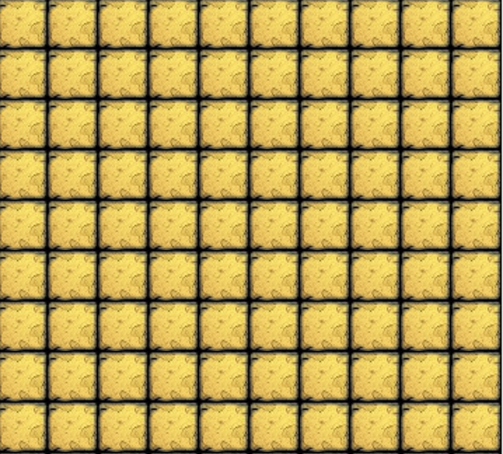
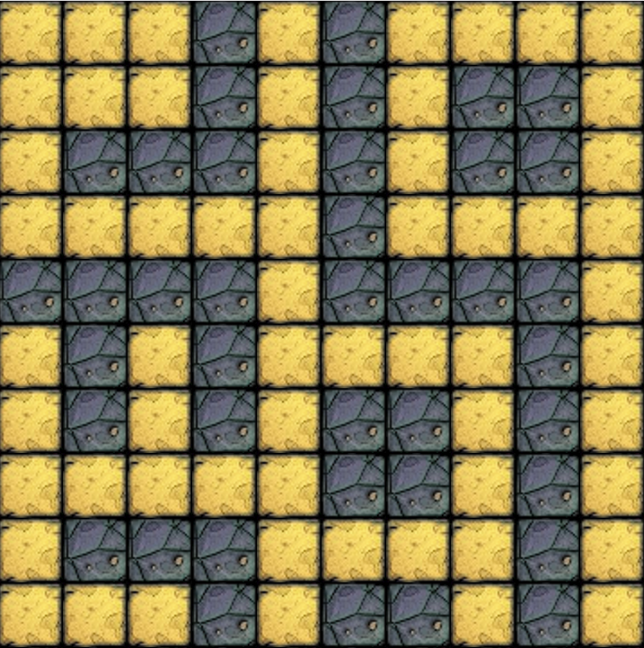

# Introduction

*Stories should be followed by implementation. Completing a story means you made
a little progress on the project.*

*Keep in mind, that you have to develop the complete game. So when working on a
specific story, you should be able to reuse the implementation later in other
parts of the game.*

## Draw a screen with tiles

### 1. Draw a single tile

- Given the launched game
- Then it should show a tile like this:

| Floor tile                  |
| --------------------------- |
|  |

### 2. Fill the screen with the tile

- Given the launched game
- Then it should show a map of tiles like this:

### 3. Add wall tiles

- Given the launched game
- When the map is rendered on the screen
- Then it should show floor and wall type tiles as well like on this layout (you
  can arrange wall differently if you wish):

| Floor tile                  | Wall tile                 |
| --------------------------- | ------------------------- |
|  |  |

## Place a character on it and move with key bindings

### 4. Add the Hero

- Given the launched game
- When the map is rendered on the screen
- Add the player character called the hero
- Then it should show a hero on the top-left corner:

| Hero                       |
| -------------------------- |
|  |

## Interactions

The player should be able to move the hero by using their arrow keys.

### 5. Move around

- Given the launched game
- When *any* of the arrow keys are pressed by the user
- Then the hero should move to that direction

### 6. Hero direction

- Given the launched game
- When the hero is moved by the arrow keys
- Then the hero should face the direction where he went

| Hero Up                | Hero Right                   | Hero Down                  | Hero Left                  |
| ---------------------- | ---------------------------- | -------------------------- | -------------------------- |
|  |  |  |  |

### 7. Map boundaries

- Given the hero on any edge of the map
- When the hero is moved by the arrow keys towards the edge
- Then it should not move or leave the map, only its direction should change if
  necessary

### 8. Walls

- Given the hero next to a wall tile
- When the hero is moved by the arrow keys towards the wall tile
- Then it should not move, only its direction should change if necessary

## Extend with different kinds of characters

### 9. Skeletons

- Given the launched game
- When the map is rendered on the screen
- Then 3 skeletons should be on the map, somewhere on floor type tiles

| Skeleton                          |
| --------------------------------- |
|  |

### 10. Boss

- Given the launched game
- When the map is rendered on the screen
- Then a boss should be on the map, somewhere on floor type tiles

| Boss                      |
| ------------------------- |
|  |

## Create HUD, fight & game logic

### 11. Stats

- Given the launched game
- When the map is rendered on the screen
- Then stats should appear below the map in a white box as black strings
    - It should contain:
        - The level of the Hero
        - The current HP (*health point*) of the Hero
        - The max HP of the Hero
        - The DP (*defend point*) of the Hero
        - The SP (*strike point*) of the Hero
    - Like this: `Hero (Level 1) HP: 8/10 | DP: 8 | SP: 6`

### 12. Strike

- Characters are able to strike as detailed in the
  [specification](/project/wanderer#strike)

### 13. Battle logic

- After a hero character performed a strike the defender should strike back the
  same way

### 14. Next area

- When the enemy with the key is killed, the hero should enter the new level
  automatically

## Optional features

### 15. Update characters on moving hero

- The characters should only move when the player moves the hero

### 16. Random map

- When map is created the placement of walls should be random
- Make sure that all floor tiles are connected

### 17. Leveling

- Add more hp / damage to the hero according to the specification
- Add more hp / damage to the monsters
- Implement random events which happen when entering the new area

### 18. Monsters moving around

- Move the monsters around regardless of player moving hero or not
- Speed up their movement level by level